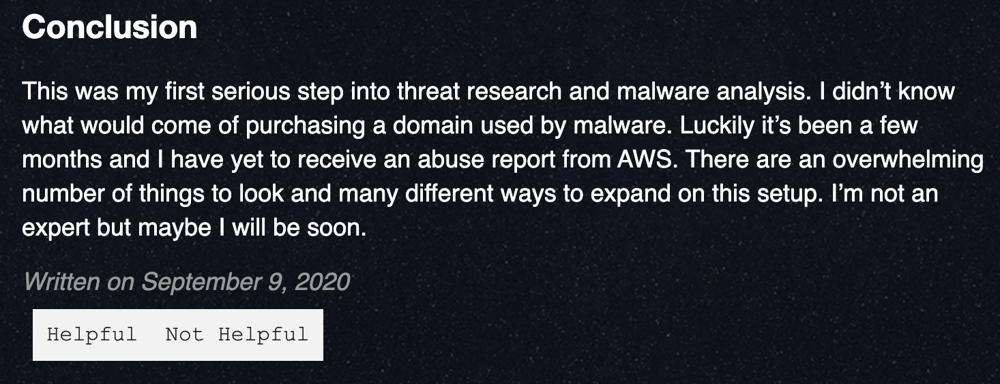
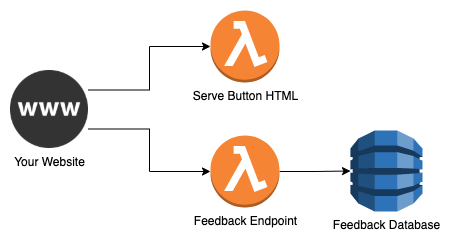

# kudozo

Get basic feedback on blog posts.



## Deployment

This project uses the [Serverless Framework](https://www.serverless.com/framework/docs/getting-started/).

```
1. Deploy the infrastructure
cd kudozo/
serverless deploy --stage production

2. Copy the GET URL in the output

3. Add the code to your website

<object data="https://UNIQUE.execute-api.us-east-1.amazonaws.com/production/button.html"></object>

4. Start receiving feedback.
```

## Cloud Infrastructure


